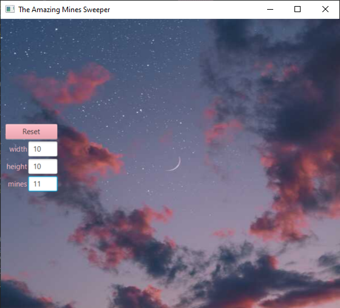
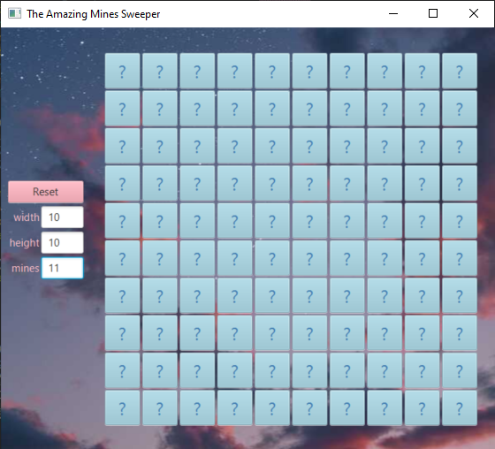
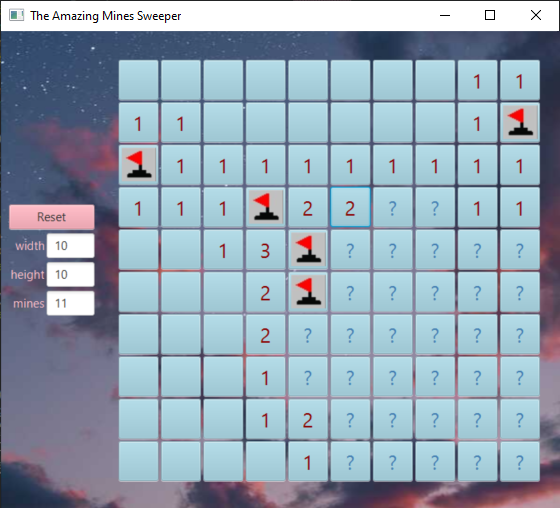
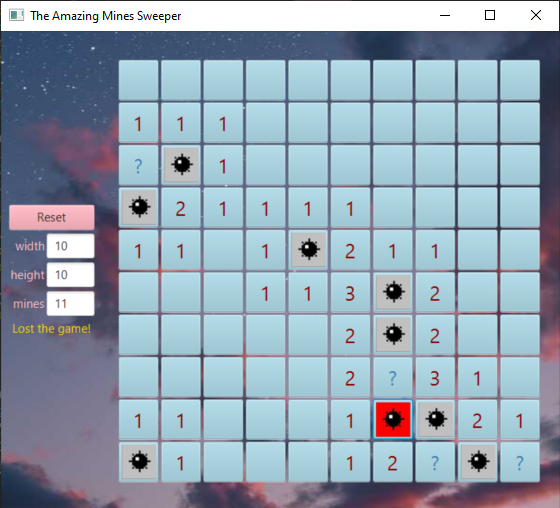

# Minesweeper game
Minesweeper is a single-player game. 
The goal of the game is to clear a rectangular board filled with hidden mines without revealing them.
In my game implementation, the player may select the board metrics and the number of mines.
# The start page

# Start of the game
Board 10X10 with 11 hidden mines.

# During the game
Here, the player can also mark with a flag the places where he thinks there is a mine, using the right-click.

# Losing game
When the player tries to open a mine, he loses the game, and then all the mines will be revealed.
He can click the reset button to remove all the board so he can choose to play a new game.

